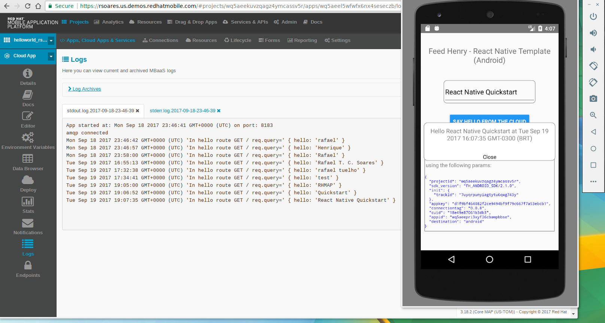

# QuickStart React Native Client-side Template
---------
Author: Carlos Vicens   
Contributors: Rafael T. C. Soares <rafaelcba at gmail dot com>   
Level: Intermediate   
Technologies: Javascript, React Native, RHMAP (former Feedhenry)   
Summary: A basic React Native client side template with RHMAP.   
Target Product: RHMAP   
Product Versions: Pending
Source: https://github.com/cvicens/quickstart-react-native   

---

## Instructions to build and run on iOS platform

### Prerequisites
- CocoaPods (for iOS)
- iOS 8, 9, 10 [SDK supported configuration](https://access.redhat.com/node/2357761)
- react-native-cli: 2.0.1
- react-native: 0.42.3
- rct-fh : 0.0.14+ [documentation](https://www.npmjs.com/package/rct-fh)

### React Native installation
To install React Native (and its CLI), please go to [Getting Started](https://facebook.github.io/react-native/docs/getting-started.html)

#### If you want to avoid reading the guide...
* Install node (v6+)
* Install React Native CLI `npm install -g react-native-cli`
* Test your installation

```
$ react-native init TestProject
$ cd TestProject
$ react-native run-ios
```

### What is it?
This application is a basic React Native client side template, it should be used in combination with the [HelloWorld cloud app](https://github.com/feedhenry-templates/helloworld-cloud).

### How do I run it

#### Clone this repo on your local machine

```
git clone https://github.com/cvicens/quickstart-react-native.git
```

#### Create a new iOS App in Studio

- Create a new iOS Objective-C Application in your RHMAP project
- Open the 'Editor' view and copy the contents of `./helloworld-ios-app/fhconfig.plist`

#### Adapt RHMAP iOS `fhconfig.plist` file in our RN application

Edit [`quickstart-react-native/ios/fhconfig.plist`](./ios/fhconfig.plist) and paste the contents copied in the previous step

### Build instructions

Inside the `quickstart-react-native` project directory (cloned from this repo):
 * `npm install` or `yarn install`
 * Run `pod install` inside the `./ios` folder
 * Build and run locally. This should start the iOS simulator, deploy the app and run it. ``react-native run-ios``

### npm dependencies
The code ([`index.android.js`](./index.android.js)) used in this template depends on a specific version (>= `0.0.14`) of ``rct-fh``. This [npm module](https://www.npmjs.com/package/rct-fh) is already available on `npmjs.com`.

---

## Instructions to build and run on Android platform

### Prerequisites

 * React Native CLI
  * requires:
    * NodeJS (>= 6.x)
    * npm
 * Android SDK (API 23 (OS Version 6.0))
 * see [SDK supported configuration](https://access.redhat.com/node/2357761)
  * requires:
    * Java Runtime
    * Gradle
 * react-native-cli: 2.0.1
 * react-native: 0.48.2
 * rct-fh : 0.0.18+ [documentation](https://gitlab.com/rafaeltuelho/RCTFH)

### React Native installation
To install React Native (and its CLI), please go to [Getting Started](https://facebook.github.io/react-native/docs/getting-started.html)

### What is it?
This application is a basic React Native client side template, it should be used in combination with the [HelloWorld cloud app](https://github.com/feedhenry-templates/helloworld-cloud).

### How do I run it

#### Clone this repo on your local machine

```
git clone https://github.com/rafaeltuelho/quickstart-react-native.git
```

#### Create a new Native Android Gradle App in Studio
- Create a new Native Android Gradle Application in your RHMAP project
- Open the 'Editor' view and copy the contents of `./app/src/main/assets/fhconfig.properties`

#### Adapt RHMAP Android `fhconfig.properties` file in our RN application

Edit [`quickstart-react-native/app/src/main/assets/fhconfig.properties`](./android/app/src/main/assets/fhconfig.properties) and paste the contents copied in the previous step

### Build instructions

Inside the `quickstart-react-native` project directory (cloned from this repo):
 * `npm install` or `yarn install`
 * Build and run locally.
  * start the Android emulator using the Android Studio
  * start the React Packager server

  ```
  npm start
  ```
  something like this output should appears on your console:

```
  > HelloWorld@0.0.1 start /home/rsoares/quickstart-react-native
  > node node_modules/react-native/local-cli/cli.js start

  Scanning 574 folders for symlinks in /home/rsoares/quickstart-react-native/node_modules (15ms)
   ┌────────────────────────────────────────────────────────────────────────────┐
   │  Running packager on port 8081.                                            │
   │                                                                            │
   │  Keep this packager running while developing on any JS projects. Feel      │
   │  free to close this tab and run your own packager instance if you          │
   │  prefer.                                                                   │
   │                                                                            │
   │  https://github.com/facebook/react-native                                  │
   │                                                                            │
   └────────────────────────────────────────────────────────────────────────────┘
  Looking for JS files in

  /home/rsoares/quickstart-react-native


  React packager ready.

  Loading dependency graph, done.  
```

* Then, run the following command on another terminal (inside your React Native project's root dir)

```
react-native run-android
Scanning 574 folders for symlinks in /home/rsoares/Workshops/RH-MAP/projects/samples/reactive-native/rct-fh-poc/HelloWorld/node_modules (5ms)
JS server already running.
Building and installing the app on the device (cd android && ./gradlew installDebug)...
Incremental java compilation is an incubating feature.

...

Installing APK 'app-debug.apk' on 'Nexus_5_API_23(AVD) - 6.0' for app:debug
Installed on 1 device.

BUILD SUCCESSFUL

Total time: 5.372 secs
Running /home/rsoares/opt/mobile/android-sdk-linux/platform-tools/adb -s emulator-5554 reverse tcp:8081 tcp:8081
Starting the app on emulator-5554 (/home/rsoares/opt/mobile/android-sdk-linux/platform-tools/adb -s emulator-5554 shell am start -n com.helloworld/com.helloworld.MainActivity)...
Starting: Intent { cmp=com.helloworld/.MainActivity }
```

If everything is ok you should see your app running on the emulator



### npm dependencies
The code ([`index.android.js`](./index.android.js)) used in this template depends on a specific version (>= `0.0.18`) of ``rct-fh``. Until that version is officially released on `npmjs.com` you can use install it from [here](https://gitlab.com/rafaeltuelho/RCTFH):

```
npm install https://github.com/rafaeltuelho/RCTFH.git --save
```

---

## Updating rct-fh version
To update the SDK:
- change the version in ``package.json``
- run ``npm install``

# A note about RHMAP Build Farm
The current version of Red Hat Mobile Hosted Build Farm does not support the build of a React Native **Client** Application. Applications generated by `react-native init` CLI has its own project structure which includes tree different parts:

 * the reactive native JS code and modules
 * the android native project (uses Gradle for build)
 * the ios native project (uses Cocoa pods for build)

One alternative would be push the ios and android directories as independent Client Apps into its own Git repository inside your Studio project. Then you could build them as Native Apps using Studio Build Farm.

Another viable approach is to use the upcoming [**"Managed Build Farm" feature"**](https://access.redhat.com/documentation/en-us/red_hat_mobile_application_platform/4.5/html/4.5.0_release_notes/release_announcement#technical_preview_of_self_managed_build_farm) which will be available on RHMAP 4.5+ (Onpremise distro). Take a look on the upstream project [**Aerogear Digger Jenkins**](https://github.com/aerogear/digger-jenkins). See a demo video [here](https://www.youtube.com/watch?v=U1qYj5thMPM).

---
